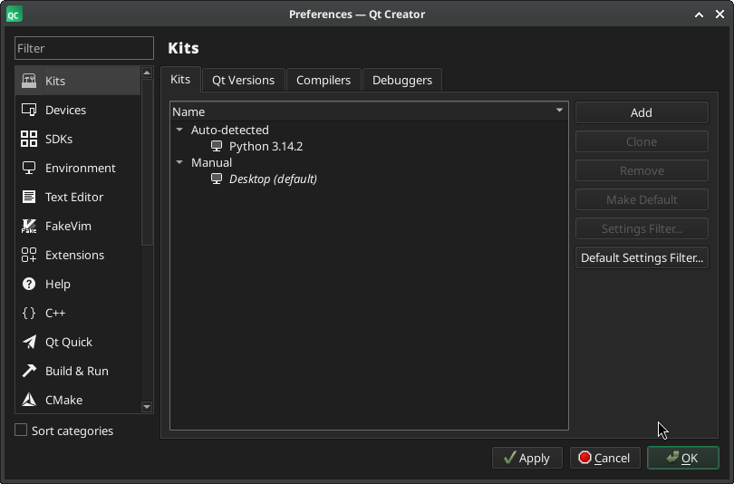
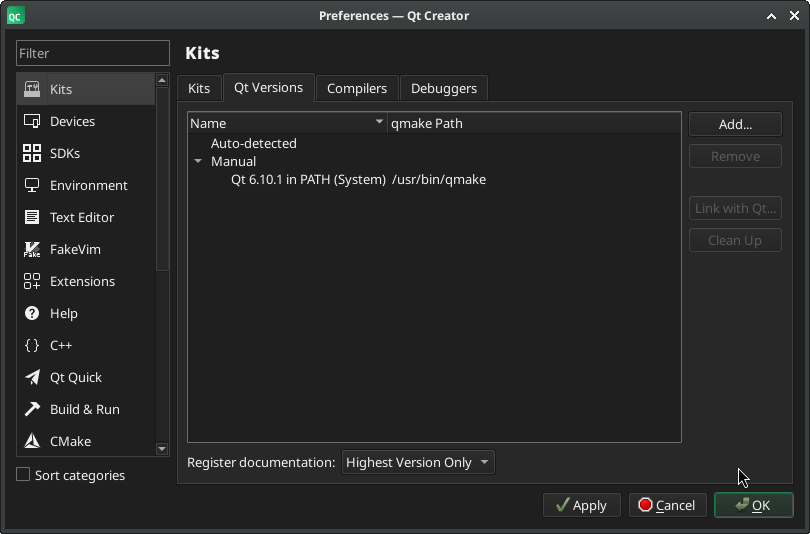
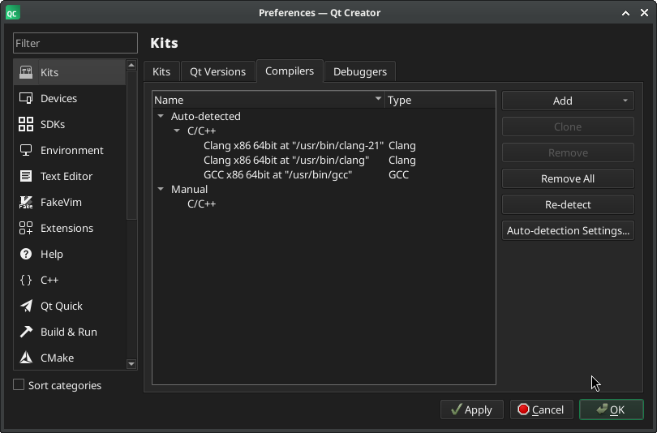
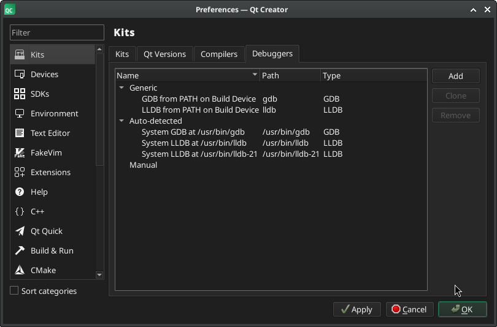
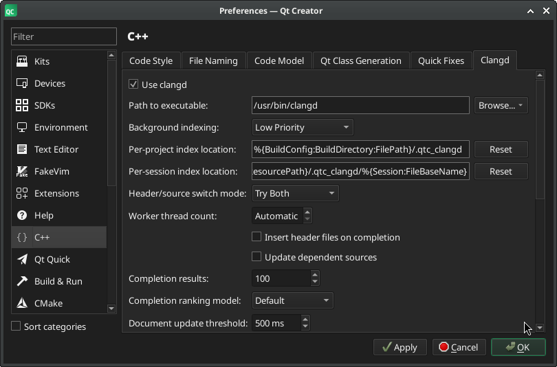
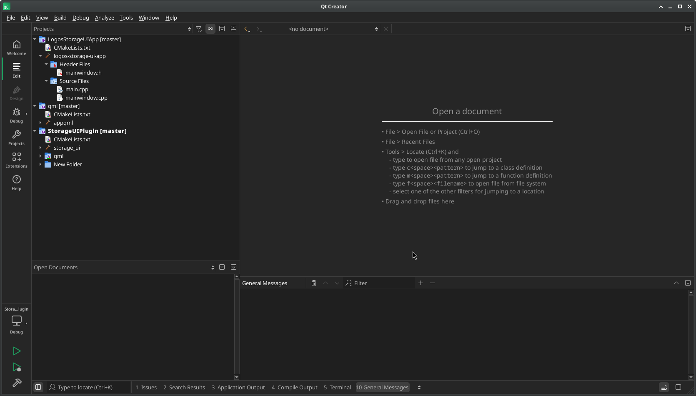

# logos-storage-ui setup

This file describes how to set up the project for development with Nix and Qt Creator / QML.
At the end of this document, you should be able to build the project using Nix in a toolbox (if SELinux is enabled) and have Qt Creator with QML Preview working, with imports working in your host environment.

## OS with SELinux enabled

If you are using Fedora, you are probably not able to install Nix without disabling SELinux. If you do so, you can move to the next section.  
Otherwise, here are the steps to have a working environment using Toolbox.

### Create the toolbox

You need to run the following commands to create the toolbox:

```bash
toolbox create logos-storage
toolbox enter logos-storage
```

### Install Nix and build

```bash
sudo dnf install nix
nix build ".#lib"
```

After the build, the `result` directory should contain two folders: `include` and `lib`.
To make the files in the `include` folder available from the host environment, we need to copy them into our `libs` folder, because the host environment does not have access to the Nix store:

```bash
rsync -aL result/include/ libs/
```

In the `libs` folder, you should now see `logos_sdk.h`.

## OS without SELinux

You need to install Nix and build the library:

```bash
nix build ".#lib"
```

In the `result/include` folder, you should see `logos_sdk.h`.

## Install Qt Creator and configure it

### Install from the repository (recommended)

If your package manager provides `qtcreator`, this is the easiest way to start. You will need to install some dependencies with it.  
Note that you should install and run it from a Toolbox, otherwise you may face `glx` errors:

```bash
sudo dnf install cmake ninja clangd qtcreator gcc
```

### Install from the installer

An alternative is to use the [Qt installer](https://www.qt.io/development/download-qt-installer).

Ensure that you already have the build tools installed (see the previous section), or let the installer install them for you (default behavior).

### Configuration

With the installer, you will need to create a Qt account in order to validate the license.

Note: Trying to create an account from the website can be confusing and may lead to creating a corporate (paid) account.

After starting Qt Creator, go to `Edit` → `Preferences` → `Kits` and go through the different tabs: `Qt Versions`, `Compilers`, and `Debuggers`.  
You should not see any error.






If you have an error, it means either your environment is not configured properly or `qtcreator` itself is misconfigured. In that case:

1. Close `qtcreator`
2. Ensure all dependencies are installed
3. Remove `~/.config/QtProject` and start Qt Creator again

Ensure that `clangd` is enabled as well: `Edit` → `Preferences` → `C++` → `Clangd`.
If not, set the path manually and restart Qt Creator.



## Run Qt Creator

The repository contains a `.clangd` file that adds the `include` folder to the include path (from `libs` in a Toolbox or `result` from a normal installation).

Thanks to this, you should have a working IDE. You can now open the project:
`File` → `Open File or Project` and select the `CMakeLists.txt` at the root of the project. In the dialog, click `Configure Project` in the bottom right.

Then open `StorageWidget.h`: you should not see any error.

Repeat this operation for the `app` and `qml` folders by opening their respective `CMakeLists.txt` files.
The `qml` folder contains a Qt Quick application used only to preview QML files.

Each project should be opened on its own, not as part of another project.
At the end, you should have something like this:



You are now ready for coding.
